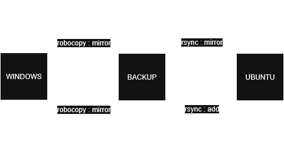

# Tasks

Automatisation scripts for miscellanous tasks and local or remote workflow.

### For Latex workflow :
 - create_notes : *initialise latex notes in folder*
 - extract_tex : *gather latex notes to local repo*
 - gather_pdf_notes : *gather all pdf notes from scattered note folders*
 - synchronize_local : *minimal version of robocopy or rsync to update local notes from repo*

### For EC2 workflow :
 - monitor_usage : *store memory activity to file*
 - tmux pre-defined sessions : *panes settings*

### For local workflow :
 - todo
 - claude_cli : *query claude in terminal and copy reply to clipboard*
 - vocab
 - backup_documents
 - gather_bins : *compiles local projects to binaries*

## Details

### Backup documents
> Synchronize data from dual boot partitions, from a "backup" ntfs partition.

Flowchart :

The "backup" partition is expected to be the newest version at each session start.
The Ubuntu session can only make additions to reduce the risk of conflict.

Regarding Windows task scheduler tricks to run at shutdown :
- https://superuser.com/questions/165142/using-task-scheduler-to-run-a-task-before-shutdown
- https://www.elevenforum.com/t/is-it-possible-to-run-a-task-at-shutdown-and-how.17300/

Scripts location :
- Ubuntu : `/bin/unix/backup/*.sh`
- Windows : `/bin/windows/backup_documents.bat`

Helper reference for `systemctl` integration in Unix :
- https://gist.github.com/chataignault/08fce29821b5b74bd5d191c57f5958c9

*** 

TODO :
- [x] add Terminal User Interface (TUI) to *todo* with [this crate](https://ratatui.rs/)
- [ ] add TUI to *vocab*
- [ ] connect *claude_cli* to vocab
- [x] *tree* CLI to browse nested article folders -> from cargo bin https://crates.io/crates/tree-rs
- [x] add script to gather binaries

Other refs :
- https://github.com/automazeio/ccpm/tree/main
- https://www.atlassian.com/agile/project-management/epics

