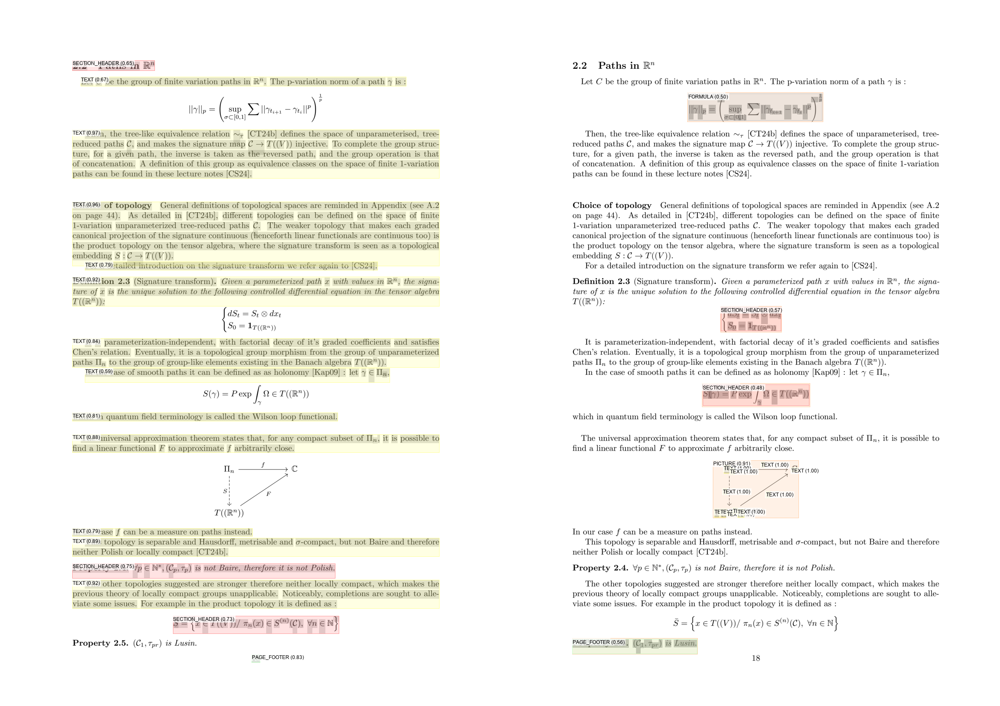
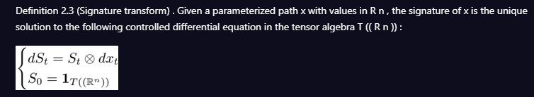

# PDF parser to Latex

Combine PDF parsing tools and OCR tools to improve the transcription of (equations in) PDFs to Latex source code.

While [Docling](https://github.com/docling-project/docling) (or [marker-pdf](https://github.com/VikParuchuri/marker) and others ) supports parsing PDF, with output extension in Markdown or JSON, it does not provide a reliable built-in way to pick up Latex source code from formulas (a number of them is snipped as an image, while others are correctly parsed).

For instance in definition 2.3 in the middle of this page :

The bracketed equation has been spinned as an image and has the following markdown result :

> [!NOTE]
> A lot of Latex formulas are actually well parsed and included in-line in the Markdown.

To try to make the behaviour of parsing equations well in formulas, Python tools already exist to parse a compiled image to Latex source code, [this one](https://github.com/lukas-blecher/LaTeX-OCR) for instance.

Eventually, for documents also containing proper images (that are not meant to be converted to Latex equations), [this paper](https://pierre.senellart.com/publications/mishra2025theoremview.pdf), presenting *TheoremView*, allows to detect paragraphs that are thought to be theorems - therefore likely to contain an equation.
See [here](https://gitlab.di.ens.fr/mishra/sys-demo) for a demo.

One can think of combining those three projects to :
- firstly enable Latex equation conversions to the markdown parsing,
- then one can ambitiously imagine a final step to have .tex extension (either from Markdown or directly using a similar approach to carry out the extraction).

@article{auer2024docling,
  title={Docling Technical Report},
  author={Auer, Christoph and Lysak, Maksym and Nassar, Ahmed and Dolfi, Michele and Livathinos, Nikolaos and Vagenas, Panos and Ramis, Cesar Berrospi and Omenetti, Matteo and Lindlbauer, Fabian and Dinkla, Kasper and others},
  journal={arXiv preprint arXiv:2408.09869},
  year={2024}
}

@software{Docling_Team_Docling,
author = {{Docling Team}},
license = {MIT},
title = {{Docling}},
url = {https://github.com/DS4SD/docling}
}

@inproceedings{mishra2025theoremview,
  title={TheoremView: A Framework for Extracting Theorem-Like Environments from Raw PDFs},
  author={Mishra, Shrey and Sharma, Neil and Gauquier, Antoine and Senellart, Pierre},
  booktitle={ECIR (European Conference on Information Retrieval)},
  pages={6},
  year={2025},
  organization={Springer}
}